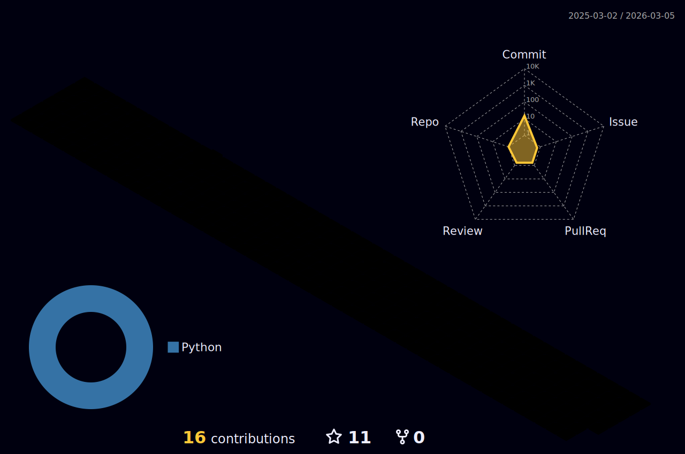

<h1 align="center">Hi 👋, I'm Ishan Jabalpure</h1>
<h3 align="center">A passionate Python developer, Competetive Coder from India</h3>

    

- 🌱 I’m currently learning **SQL, Django, CS Fundamentals**

- 💬 Ask me about **Python**

- 📫 You can reach me using : [**Email**](mailto:jabalpureishan7@gmail.com)
  
- 🔭 You can view my resume [**Here**](https://drive.google.com/file/d/1-ZZ-HpIyA_mvAFc2-Z250wkdnhpQ--BK/view?usp=sharing)
<!--
<h3 align="left">Connect with me:</h3>

-->

# 💻 Tech Stack:
           

#  Statistics :

 

  

 

  

 

  <a href="https://www.leetcode.com/jabalpureishan">
    
  

 

 

  

 

  

<!--

-->
<!--
**jabalpureishan/jabalpureishan** is a ✨ _special_ ✨ repository because its `README.md` (this file) appears on your GitHub profile.

Here are some ideas to get you started:

- 🔭 I’m currently working on ...
- 🌱 I’m currently learning ...
- 👯 I’m looking to collaborate on ...
- 🤔 I’m looking for help with ...
- 💬 Ask me about ...
- 📫 How to reach me: ...
- 😄 Pronouns: ...
- ⚡ Fun fact: ...
-->
