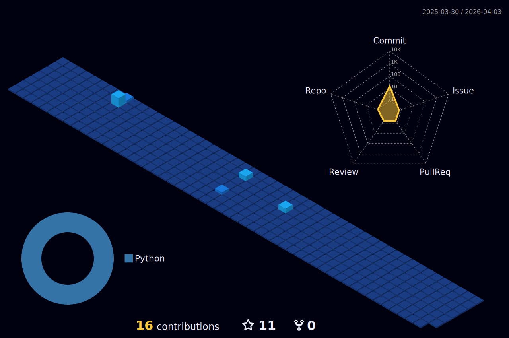

<h1 align="center">Hi 👋, I'm Ishan Jabalpure</h1>
<h3 align="center">A passionate Python developer, Competetive Coder from India</h3>

  

- 🌱 I’m currently learning **SQL, Django, CS Fundamentals**

- 💬 Ask me about **Python**

- 📫 You can reach me using : **jabalpureishan7@gmail.com**
<!--
<h3 align="left">Connect with me:</h3>

 
 

-->
<h3 align="left">Languages and Tools:</h3>

 <a href="https://www.arduino.cc/" target="_blank" rel="noreferrer">
   
  
  
  
  
  
  
  
  

#  Statistics :
<!--
 

  <a href="https://www.leetcode.com/jabalpureishan">
    
  

-->
 

  

 

  

 

 

  

 

  

<!--

-->
<!--
**jabalpureishan/jabalpureishan** is a ✨ _special_ ✨ repository because its `README.md` (this file) appears on your GitHub profile.

Here are some ideas to get you started:

- 🔭 I’m currently working on ...
- 🌱 I’m currently learning ...
- 👯 I’m looking to collaborate on ...
- 🤔 I’m looking for help with ...
- 💬 Ask me about ...
- 📫 How to reach me: ...
- 😄 Pronouns: ...
- ⚡ Fun fact: ...
-->
